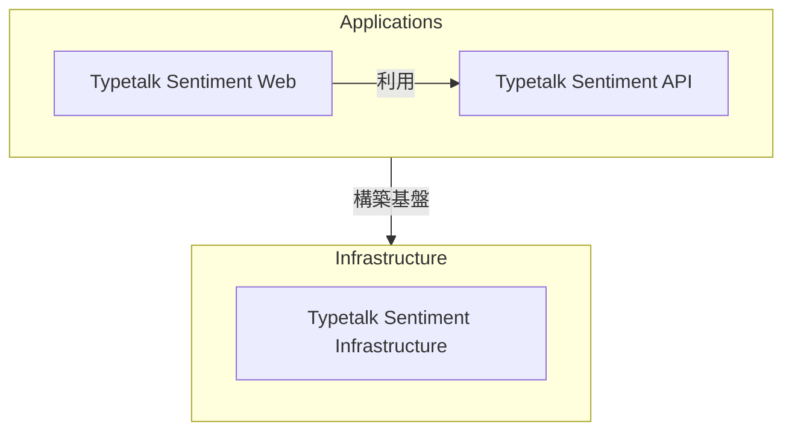

# Typetalk Sentimentプロジェクト

## プロジェクトの概要

Typetalk Sentimentプロジェクトは、チームコミュニケーションツール「Typetalk」のメッセージを感情分析し、メッセージの客観的な理解とコミュニケーションの改善を支援するビジネスツールの開発プロジェクトです。

### 解決する課題

1. メッセージの客観的な理解
   - 送信したメッセージが与える印象の客観的な把握
   - 受け取ったメッセージの感情をデータとして確認
   - コミュニケーションにおける感情の行き違いの防止

2. コミュニケーションの改善
   - 感情分析結果による自身のコミュニケーションスタイルの確認
   - 相手のメッセージの感情傾向の理解
   - より良いコミュニケーションに向けた気づきの機会を提供

## 主要機能

- Typetalkの組織とトピックの一覧表示
- 選択したトピックのメッセージ一覧表示
- メッセージの感情分析結果の視覚化

## システム構成

本システムは以下の3つのサブシステムで構成されています。

1. Typetalk Sentiment Web [(詳細)](./apps/web/README.md)
    - 役割:メッセージの感情分析結果を分かりやすく表示するユーザーインターフェース
    - 機能
        - Typetalk Sentiment APIを通じたメッセージの取得
        - メッセージの感情分析結果の表示

2. Typetalk Sentiment API [(詳細)](./apps/api/README.md)
    - 役割:メッセージの取得と感情分析を行うバックエンドサービス
    - 機能
        - Typetalkからメッセージを取得
        - メッセージの感情を分析

3. Typetalk Sentiment Infrastructure [(詳細)](./infra/iac/cdk/README.md)
    - 役割:システムの実行環境を提供するインフラストラクチャ
    - 機能
        - インフラストラクチャのコード管理

## 技術スタック

- フロントエンド: Next.js, TypeScript
- バックエンド: FastAPI, Python
- インフラストラクチャ: AWS CDK, TypeScript

## 外部サービス連携

- Typetalk
  - 用途:組織、トピック、メッセージデータの取得
  - [Typetalk API公式ドキュメント](https://developer.nulab.com/ja/docs/typetalk/)

- Amazon Comprehend
  - 用途:メッセージの感情分析に使用
  - [Amazon Comprehend公式ドキュメント](https://docs.aws.amazon.com/ja_jp/comprehend/latest/dg/what-is.html)

## ドキュメント

プロジェクトの開発に関する詳細は、以下のドキュメントをご覧ください。

- [Typetalk Sentiment ドキュメント一覧](./docs/document-index.md)

## セットアップ手順

ローカル開発環境のセットアップ手順は、以下のドキュメントをご覧ください。

- [ローカル開発環境のセットアップ](./docs/setup.md)
