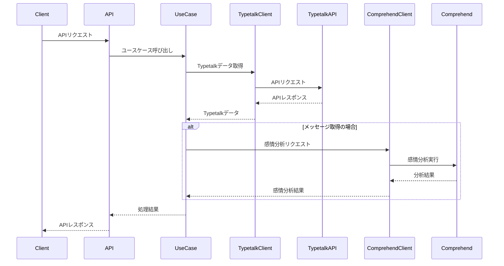

# Typetalk Sentiment API アーキテクチャ概要

## 目次

1. [アプリケーション概要](#アプリケーション概要)
2. [技術スタック](#技術スタック)
3. [アプリケーション構成](#アプリケーション構成)
4. [外部サービスとの連携](#外部サービスとの連携)
5. [API仕様](#api仕様)
6. [関連ドキュメント](#関連ドキュメント)

## アプリケーション概要

Typetalk Sentiment APIは、チャットメッセージの感情分析を行うバックエンドAPIである。本アプリケーションは、Typetalk APIを通じてメッセージデータを取得し、Amazon Comprehendを使用して感情分析を行う。

## 技術スタック

- Python
- FastAPI
- AWS SDK (boto3)
- pytest

バージョン情報の詳細は [pyproject.toml](../pyproject.toml) を参照すること。

## アプリケーション構成

### アプリケーション構成要素

本アプリケーションは、以下の5つの主要コンポーネントで構成される。

1. FastAPI アプリケーション ([src/main.py](../src/main.py))
   - アプリケーションのエントリーポイント
   - ルーティング設定
   - 例外ハンドラの登録

2. ルーター ([src/api/routers.py](../src/api/routers.py))
   - APIエンドポイントの定義
   - ユースケースの呼び出し

3. ユースケース ([src/use_cases/](../src/use_cases/))
   - 外部サービスの呼び出し制御
   - ビジネスロジックの実装

4. データモデル ([src/schemas/](../src/schemas/))
   - リクエスト/レスポンスの型定義

5. インフラストラクチャ ([src/infrastructure/](../src/infrastructure/))
   - 外部サービスクライアントの実装
   - 外部サービスの抽象化

### 処理フロー

本アプリケーションは、Typetalkからのデータ取得と感情分析を以下の流れで実行する。メッセージ取得時には、Amazon Comprehendによる感情分析も実行される。

## 外部サービスとの連携

本アプリケーションでは以下の外部サービスを利用する。

### Typetalk API

- 主要エンドポイント:
  - 組織一覧: `GET /api/v1/spaces`
  - トピック一覧: `GET /api/v3/topics`
  - メッセージ一覧: `GET /api/v1/topics/{topic_id}`
- 実装: [TypetalkApi クラス](../src/infrastructure/typetalk/typetalk_api.py)
- 詳細: [Typetalk API公式ドキュメント](https://developer.nulab.com/ja/docs/typetalk/)

### Amazon Comprehend

- 機能: テキストの感情分析（ポジティブ、ネガティブ、中立、混合）
- 実装: [AwsComprehendApi クラス](../src/infrastructure/aws/comprehend/aws_comprehend_api.py)
- 詳細: [Amazon Comprehend ドキュメント](https://docs.aws.amazon.com/ja_jp/comprehend/)

## API仕様

FastAPIは、アプリケーションのAPI仕様をOpenAPI形式で自動生成する。この仕様は以下の方法で確認できる：

- Swagger UI: <http://localhost:8080/docs>
- OpenAPI仕様: <http://localhost:8080/openapi.json>

## 関連ドキュメント

- [Typetalk Sentiment システムアーキテクチャ概要](../../../docs/system-architecture.md)
- [Typetalk Sentiment Web アーキテクチャ概要](../../web/docs/architecture-web.md)
