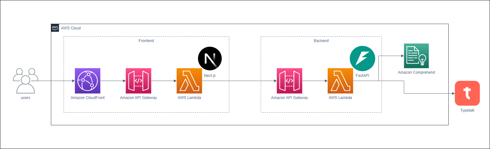
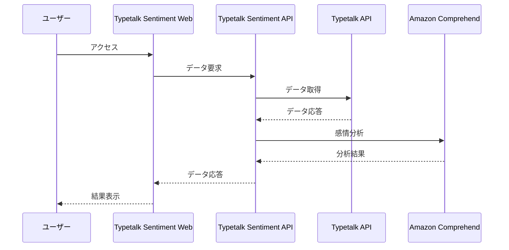

# Typetalk Sentiment システムアーキテクチャ概要

## 目次

1. [概要](#概要)
2. [アーキテクチャ図](#アーキテクチャ図)
3. [システム構成](#システム構成)
4. [外部サービス連携](#外部サービス連携)
5. [処理フロー](#処理フロー)
6. [技術スタック](#技術スタック)
7. [環境構成](#環境構成)
8. [デプロイメント](#デプロイメント)
9. [関連ドキュメント](#関連ドキュメント)

## 概要

本ドキュメントでは、Typetalk Sentimentシステム全体像と、各サブシステム間の関係性について説明する。

## アーキテクチャ図

本システムはAWS Cloudのサーバーレスアーキテクチャで構築される。フロントエンドはNext.js、バックエンドはFastAPIを採用し、TypetalkとAmazon Comprehendと連携する。

## システム構成

本システムは以下の3つのサブシステムで構成されている。

1. Typetalk Sentiment Web
   - 概要: ユーザーインターフェースを提供するNext.jsアプリケーション
   - 主な責務:
     - ユーザー認証の処理
     - APIとの通信
     - データの視覚化

2. Typetalk Sentiment API
   - 概要: FastAPIを使用したAPIサーバー
   - 主な責務:
     - Typetalkデータの取得
     - 感情分析の実行
     - 分析結果の提供

3. Typetalk Sentiment Infrastructure
   - 概要: AWS CDKを使用したクラウドインフラストラクチャ
   - 主な責務:
     - クラウドリソースの管理
     - デプロイメントの自動化
     - 運用環境の提供

各サブシステムの詳細な実装については、それぞれ以下のドキュメントを参照すること。

- [Typetalk Sentiment Web](../apps/web/README.md)
- [Typetalk Sentiment API](../apps/api/README.md)
- [Typetalk Sentiment Infrastructure](../infra/iac/cdk/README.md)

## 外部サービス連携

本システムは以下の外部サービスと連携する。

- Typetalk
  - 用途:組織、トピック、メッセージデータの取得
  - [Typetalk API公式ドキュメント](https://developer.nulab.com/ja/docs/typetalk/)

- Amazon Comprehend
  - 用途:メッセージの感情分析に使用
  - [Amazon Comprehend公式ドキュメント](https://docs.aws.amazon.com/ja_jp/comprehend/latest/dg/what-is.html)

## 処理フロー

本システムにおける主要な処理の流れを以下のシーケンス図で示す。

## 技術スタック

### Typetalk Sentiment Web

- フレームワーク: Next.js
- 言語: TypeScript

### Typetalk Sentiment API

- フレームワーク: FastAPI
- 言語: Python

### Typetalk Sentiment Infrastructure

- AWS CDK

## 環境構成

システムは以下の3つの環境で構成される。

### ローカル開発環境

- 目的: 開発作業用
- 構成:
  - Typetalk Sentiment Web: ローカルNext.jsサーバー
  - Typetalk Sentiment API: ローカルFastAPIサーバー
  - 外部サービス: モック環境またはTypetalk, Amazon Comprehend

### ステージング環境

- 目的: 本番相当の検証用
- 構成:
  - Typetalk Sentiment Web: AWS Lambda/Next.js
  - Typetalk Sentiment API: AWS Lambda/FastAPI
  - 外部サービス: 本番と同様の構成

### 本番環境

- 目的: 実サービス提供用
- 構成:
  - Typetalk Sentiment Web: AWS Lambda/Next.js
  - Typetalk Sentiment API: AWS Lambda/FastAPI
  - 外部サービス: Typetalk, Amazon Comprehend

## デプロイメント

システムのデプロイメントにはAWS CDKを使用している。

詳細なデプロイ手順書については、[デプロイ手順書](../infra/iac/cdk/docs/deployment-guide-dev.md)を参照すること。

## 関連ドキュメント

- [Typetalk Sentiment Web アーキテクチャ概要](../apps/web/docs/architecture-web.md)
- [Typetalk Sentiment API アーキテクチャ概要](../apps/api/docs/architecture-api.md)
